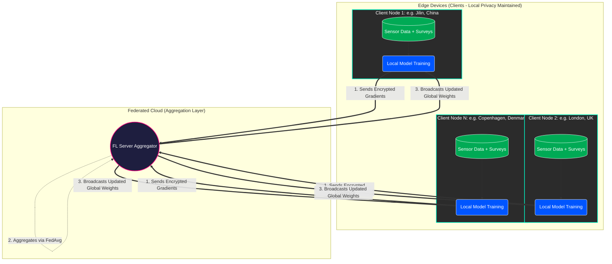

# Federated Learning for Mental Wellbeing Prediction 🧠📱

> **A privacy-preserving Federated Learning (FL) system leveraging cross-cultural multimodal smartphone sensor data to predict human mood and wellbeing while explicitly addressing real-world challenges like domain shift, cold-starts, and non-IID client distributions.**


## 📖 Table of Contents
- [Architecture & Flow](#-architecture--flow)
- [Project Overview](#-project-overview)
- [The DiversityOne Dataset](#-the-diversityone-dataset)
- [Deep Learning Models](#-deep-learning-models)
- [Installation & Setup](#-installation--setup)
- [Usage: Centralized vs Federated](#-usage-centralized-vs-federated)
- [Key Findings & Generalization](#-key-findings--generalization)

---

## 🏗 Architecture & Flow

The system runs a **Zero-Trust Federated Learning** architecture. All sensitive behavioral metrics remain strictly on the user's edge device. Only decentralized, mathematically encrypted gradient updates are communicated over the network to the federated server for aggregation via `FedAvg`.



*(You can place images from the report here: ``)*

---

## 🌍 Project Overview
Mental health tracking usually relies on invasive tracking or globally biased models. This project presents a dual study on **Mood Prediction** and **Cross-Country Generalization** relying purely on Edge AI tools.

We analyze two paradigms:
1. **Multimodal Mood Classification:** Using deep architectures on passive sensors and self-reports natively on the client.
2. **Cross-Country Regression (Domain Shift):** Analyzing how an FL model trains over diverse global datasets compared to a centralized approach, simulating phenomena like **Client Drift**, **Mode Collapse**, and **Cold States (Cascading FL)**.

---

## 📊 The DiversityOne Dataset
We use the **DiversityOne** dataset collected via the `iLog` app.
- **Scope:** 666 active participants across 8 countries (Global North and Global South).
- **Data Modalities:**
  - **Sensors:** Accelerometer, Bluetooth, Screen Status, Battery, Location variance, etc. (high frequency).
  - **Static Profiles:** Demographics, Big Five Inventory personality traits.
- **Benefit:** Highly resistant to geographic model bias.

*(You can place the sensor table image from the report here: ``)*

---

## 🧠 Deep Learning Models
The solution incorporates distinct architectures tailored for dynamic tabular/time-series data:
- **`TimeSeriesLSTM`**: Ingests sequential, fine-grained temporal sensor data over rolling windows to capture fatigue, movement habits, and interaction consistency.
- **`StaticNet` (MLP)**: Processes single-frame localized inputs and static questionnaires (e.g., Demographics, Jungian scale).
- **`TabM_Single` (Tabular Foundation)**: Optimized specifically for categorical and mixed tabular behavioral records across participants.

---

## ⚙️ Installation & Setup

1. **Clone and Install Dependencies:**
```bash
# Recommended: Create a virtual environment
python -m venv venv
source venv/bin/activate

# Install requirements via pip
pip install -r requirements.txt

# Or, if using Hatch/UV (based on pyproject.toml):
pip install .
```

---

## 🚀 Usage: Centralized vs Federated

### 1. Centralized Baseline (The "Global Oracle")
To run the traditional, non-privacy centralized training loop on the aggregated dataset:
```bash
python centralized/train_central.py
```

### 2. Federated Distributed Training (`flwr`)
To start the multi-node, zero-trust training, open separate terminal windows.

**Start the FL Server:**
```bash
flower-server-app federated.server:app --insecure
# Or directly run: flwr run .
```

**Start Local Clients (Edge nodes):**
```bash
flower-client-app federated.client:app --insecure
```

### 3. Model Back-to-Back Evaluation
To evaluate the Centralized Weights against the Federated Weights on downstream tasks, run the unified entry point:
```bash
python main.py
```
This generates an end-to-end `classification_report` testing how well the global federated edge models stood off against a pure centralized database.

---

## 📉 Key Findings & Generalization
- **Privacy vs Performance:** FL achieves parity against heavily centralized oracles when handling mild Non-IID distributions but highlights significant **client drift** when training strictly on heavily skewed individual user states.
- **Cross-Cultural Shift:** Generalization from Global South (Jilin, China) to Global North (London/Copenhagen) demonstrates how Federated Learning inherently handles generalized cross-demographic variances better over prolonged multi-round server updates. 
- **Cold-Start Validation:** Integrating "Cascading FL" simulates new user app installations perfectly, preventing system halts on minimal initial data drops.

*(You can place conclusion graphs from the report here: ``)*
